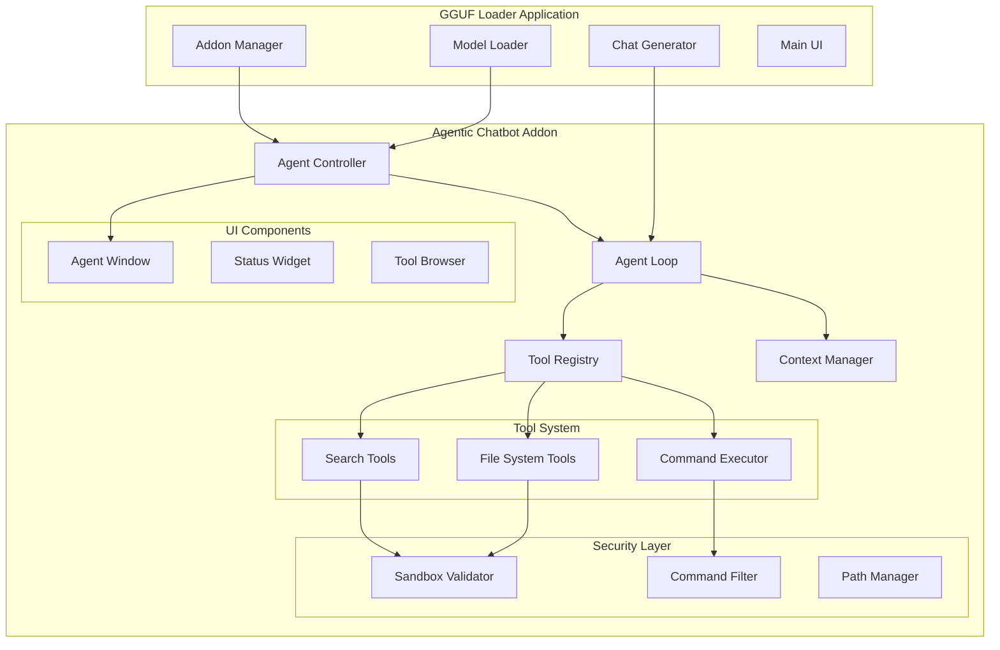

# Design Document: Agentic Chatbot Addon

## Overview

The Agentic Chatbot addon transforms the existing GGUF loader application into an autonomous agent system capable of performing file operations, executing commands, and providing a Claude Computer Use-like experience for local AI models. The system integrates seamlessly with the existing GGUF loader architecture while adding comprehensive tool-calling capabilities, security sandboxing, and agent orchestration features.

The addon follows the established addon pattern used by the floating_chat addon, creating a new addon in the `addons/agentic_chatbot/` directory that integrates with the existing model loading, chat generation, and UI systems.

## Architecture

### High-Level Architecture



### Integration Points

The addon integrates with existing GGUF loader components:

1. **Model Loading**: Uses existing `models/model_loader.py` and `models/chat_generator.py`
2. **Addon System**: Follows existing `addon_manager.py` patterns with `register()` function
3. **UI Framework**: Uses PySide6/Qt6 following existing UI patterns in `ui/` directory
4. **Configuration**: Integrates with existing configuration system in `config.py`

## Components and Interfaces

### Core Components

#### 1. Agent Controller (`main.py`)
The main addon class that orchestrates the agentic system:

```python
class AgenticChatbotAddon(QObject):
    def __init__(self, gguf_app_instance):
        # Initialize with reference to main GGUF app
        
    def start(self) -> bool:
        # Start the agentic system
        
    def stop(self) -> bool:
        # Stop and cleanup
        
    def create_agent_session(self, workspace_path: str) -> AgentSession:
        # Create new agent session with workspace
```

#### 2. Agent Loop (`agent_loop.py`)
Manages the conversation cycle and tool orchestration:

```python
class AgentLoop(QThread):
    tool_call_requested = Signal(dict)
    tool_result_received = Signal(dict)
    response_generated = Signal(str)
    
    def __init__(self, model, chat_generator, tool_registry):
        # Initialize with existing GGUF components
        
    def process_user_message(self, message: str):
        # Process user input and generate agent response
        
    def execute_tool_calls(self, tool_calls: List[dict]):
        # Execute requested tool calls
        
    def generate_response(self, context: str):
        # Generate final response using existing chat generator
```

#### 3. Tool Registry (`tool_registry.py`)
Manages available tools and their execution:

```python
class ToolRegistry:
    def __init__(self, sandbox_validator, command_filter):
        self.tools = {}
        self.sandbox_validator = sandbox_validator
        self.command_filter = command_filter
        
    def register_tool(self, tool_class):
        # Register a new tool
        
    def execute_tool(self, tool_name: str, parameters: dict) -> dict:
        # Execute tool with security validation
        
    def get_tool_schemas(self) -> List[dict]:
        # Get JSON schemas for all tools
```

### Security Components

#### 1. Sandbox Validator (`security/sandbox.py`)
Enforces workspace boundaries and path security:

```python
class SandboxValidator:
    def __init__(self, workspace_root: Path):
        self.workspace_root = workspace_root.resolve()
        
    def validate_path(self, path: str) -> Path:
        # Validate path is within workspace
        # Resolve symlinks and prevent traversal
        
    def is_safe_path(self, path: Path) -> bool:
        # Check if path is safe for operations
        
    def sanitize_path(self, path: str) -> Path:
        # Convert relative path to safe absolute path
```

#### 2. Command Filter (`security/command_filter.py`)
Validates and filters command execution:

```python
class CommandFilter:
    def __init__(self, config: dict):
        self.allowed_commands = config.get('allowed_commands', [])
        self.denied_commands = config.get('denied_commands', [])
        
    def validate_command(self, command: str) -> bool:
        # Check if command is allowed
        
    def sanitize_command(self, command: str) -> str:
        # Sanitize command for safe execution
```

### Tool System

#### 1. Base Tool Class (`tools/base.py`)
Abstract base for all tools:

```python
class BaseTool(ABC):
    @property
    @abstractmethod
    def name(self) -> str:
        pass
        
    @property
    @abstractmethod
    def description(self) -> str:
        pass
        
    @abstractmethod
    def get_schema(self) -> dict:
        # Return JSON schema for tool parameters
        
    @abstractmethod
    def execute(self, parameters: dict) -> dict:
        # Execute tool with given parameters
```

#### 2. File System Tools (`tools/filesystem.py`)
Implements file operations:

```python
class ListDirectoryTool(BaseTool):
    def execute(self, parameters: dict) -> dict:
        # List directory contents with filtering
        
class ReadFileTool(BaseTool):
    def execute(self, parameters: dict) -> dict:
        # Read file with encoding detection
        
class WriteFileTool(BaseTool):
    def execute(self, parameters: dict) -> dict:
        # Write file atomically
        
class EditFileTool(BaseTool):
    def execute(self, parameters: dict) -> dict:
        # Perform targeted file edits
```

#### 3. Command Execution Tool (`tools/execution.py`)
Executes shell commands safely:

```python
class ExecuteCommandTool(BaseTool):
    def __init__(self, command_filter, timeout=30):
        self.command_filter = command_filter
        self.timeout = timeout
        
    def execute(self, parameters: dict) -> dict:
        # Execute command with timeout and capture output
```

### UI Components

#### 1. Agent Window (`ui/agent_window.py`)
Main interface for agent interaction:

```python
class AgentWindow(QWidget):
    def __init__(self, agent_controller):
        # Create agent chat interface
        
    def setup_ui(self):
        # Setup chat interface, workspace selector, tool status
        
    def send_message(self, message: str):
        # Send message to agent
        
    def display_tool_call(self, tool_call: dict):
        # Show tool execution in UI
```

#### 2. Status Widget (`status_widget.py`)
Addon sidebar status display:

```python
class AgenticChatbotStatusWidget(QWidget):
    def __init__(self, addon):
        # Create status display for addon sidebar
        
    def update_status(self, status: str):
        # Update addon status
```

## Data Models

### Tool Call Protocol

Based on research into JSON tool calling protocols, the system uses this structured format:

```python
# Tool Call Request
{
    "tool": "read_file",
    "parameters": {
        "path": "src/main.py",
        "encoding": "utf-8"
    },
    "call_id": "call_001"
}

# Tool Call Response
{
    "call_id": "call_001",
    "status": "success",  # or "error"
    "result": "file contents here...",
    "error": null,
    "execution_time": 0.123
}
```

### Agent Session State

```python
@dataclass
class AgentSession:
    session_id: str
    workspace_path: Path
    conversation_history: List[dict]
    active_tools: List[str]
    security_context: dict
    created_at: datetime
    last_activity: datetime
```

### Configuration Schema

```python
@dataclass
class AgentConfig:
    # Workspace settings
    default_workspace: str = "./agent_workspace"
    auto_create_workspace: bool = True
    
    # Security settings
    allowed_commands: List[str] = field(default_factory=lambda: [
        "ls", "grep", "find", "cat", "head", "tail", "wc", "sort", "uniq"
    ])
    denied_commands: List[str] = field(default_factory=lambda: [
        "rm", "sudo", "chmod", "chown", "dd", "mkfs"
    ])
    command_timeout: int = 30
    
    # Agent behavior
    max_iterations: int = 15
    max_tool_calls_per_turn: int = 5
    enable_multi_step_planning: bool = True
    
    # Model settings (inherited from existing config)
    temperature: float = 0.1
    max_tokens: int = 2048
```

### Acceptance Criteria Testing Prework

1.1 WHEN the agent needs to list directory contents, THE File_System_Tool SHALL enumerate files and subdirectories with optional filtering
  Thoughts: This is about how the file system tool should behave across all directories and filtering options. We can test this by generating random directory structures and filter parameters, then verifying the tool returns correct results.
  Testable: yes - property

1.2 WHEN the agent needs to read a file, THE File_System_Tool SHALL read complete file contents with automatic encoding detection
  Thoughts: This is about file reading behavior across all files and encodings. We can test with various file types and encodings to ensure correct reading.
  Testable: yes - property

1.3 WHEN the agent needs to create or modify a file, THE File_System_Tool SHALL write content atomically to prevent corruption
  Thoughts: This is about atomic write operations across all files. We can test by attempting concurrent writes and verifying atomicity.
  Testable: yes - property

1.4 WHEN the agent needs to make targeted edits, THE File_System_Tool SHALL perform find-replace operations and line insertions
  Thoughts: This is about edit operations working correctly across all file types and edit patterns. We can test with various edit scenarios.
  Testable: yes - property

2.1 WHEN the agent needs to find content across files, THE Search_Tool SHALL perform regex and text searches with context
  Thoughts: This is about search functionality working across all file types and search patterns. We can test with various search queries and file contents.
  Testable: yes - property

3.1 WHEN the agent requests command execution, THE Command_Executor SHALL validate commands against an allowlist
  Thoughts: This is about command validation working for all possible commands. We can test by generating various commands and verifying allowlist enforcement.
  Testable: yes - property

3.2 WHEN a dangerous command is requested, THE Command_Filter SHALL reject the command and log the attempt
  Thoughts: This is about security enforcement across all dangerous commands. We can test with various dangerous command patterns.
  Testable: yes - property

4.1 WHEN any file operation is requested, THE Sandbox_Validator SHALL ensure all paths are within the designated workspace
  Thoughts: This is about path validation working for all possible paths. We can test with various path traversal attempts and valid paths.
  Testable: yes - property

4.2 WHEN path traversal attempts are detected, THE Sandbox_Validator SHALL reject the operation and log the security violation
  Thoughts: This is about security enforcement for path traversal attacks. We can test with various traversal patterns.
  Testable: yes - property

5.1 WHEN the agent makes a tool call, THE Tool_Protocol SHALL use structured JSON format with tool name, parameters, and call ID
  Thoughts: This is about protocol format consistency across all tool calls. We can test by generating various tool calls and verifying format.
  Testable: yes - property

5.2 WHEN tools execute successfully, THE Tool_Protocol SHALL return results with success status and call ID
  Thoughts: This is about response format consistency for successful executions. We can test across all tool types.
  Testable: yes - property

6.1 WHEN a user provides a task, THE Agent_Loop SHALL generate reasoning and appropriate tool calls
  Thoughts: This is about agent behavior across different task types. We can test with various task scenarios.
  Testable: yes - property

7.1 WHEN the addon is loaded, THE Addon_Manager SHALL integrate the agentic chatbot following existing addon patterns
  Thoughts: This is about integration following established patterns. We can test the integration process.
  Testable: yes - example

### Property Reflection

After reviewing the prework analysis, I identified several areas where properties can be consolidated:

- Properties 1.1-1.4 (file operations) can be combined into comprehensive file system operation properties
- Properties 3.1-3.2 (command validation) can be combined into command security properties  
- Properties 4.1-4.2 (sandbox validation) can be combined into workspace security properties
- Properties 5.1-5.2 (tool protocol) can be combined into protocol consistency properties

## Correctness Properties

*A property is a characteristic or behavior that should hold true across all valid executions of a system—essentially, a formal statement about what the system should do. Properties serve as the bridge between human-readable specifications and machine-verifiable correctness guarantees.*

### Property 1: File System Operations Workspace Confinement
*For any* file system operation (read, write, list, edit), all file paths should be validated to ensure they remain within the designated workspace boundaries, and operations on paths outside the workspace should be rejected.
**Validates: Requirements 1.1, 1.2, 1.3, 1.4, 4.1**

### Property 2: Path Traversal Attack Prevention  
*For any* file path containing traversal patterns (../, symlinks, absolute paths outside workspace), the sandbox validator should reject the operation and log a security violation.
**Validates: Requirements 4.2**

### Property 3: Command Security Enforcement
*For any* command execution request, commands not on the allowlist should be rejected, dangerous commands should be blocked regardless of parameters, and all security violations should be logged.
**Validates: Requirements 3.1, 3.2**

### Property 4: Tool Call Protocol Consistency
*For any* tool call, the request should follow the structured JSON format with required fields (tool, parameters, call_id), and responses should include status, result/error, and matching call_id.
**Validates: Requirements 5.1, 5.2**

### Property 5: Search Operations Accuracy
*For any* search query across files, the search tool should return results with correct line numbers, context, and match all instances of the search pattern within the workspace.
**Validates: Requirements 2.1, 2.3**

### Property 6: Agent Loop Tool Integration
*For any* user task requiring tool usage, the agent loop should generate appropriate tool calls, handle responses correctly, and integrate results into the conversation context.
**Validates: Requirements 6.1, 6.2**

### Property 7: Atomic File Operations
*For any* file write or edit operation, the operation should complete atomically (all-or-nothing) to prevent file corruption, even under concurrent access or system interruption.
**Validates: Requirements 1.3, 1.4**

### Property 8: Configuration Integration Round-trip
*For any* configuration setting, saving and loading the configuration should preserve all values, and the agent should use existing GGUF loader configuration patterns.
**Validates: Requirements 7.4, 10.1**

## Error Handling

### Security Error Handling
- **Path Traversal Violations**: Log security event, return clear error message, maintain audit trail
- **Command Execution Blocks**: Log blocked command, return explanation of security policy
- **Workspace Boundary Violations**: Reject operation, log attempt, suggest valid alternatives

### Tool Execution Error Handling  
- **Tool Not Found**: Return structured error with available tool list
- **Invalid Parameters**: Validate against JSON schema, return specific validation errors
- **Execution Timeouts**: Terminate gracefully, return timeout error with partial results if available
- **Permission Errors**: Return clear permission error, suggest workspace setup steps

### Agent Loop Error Handling
- **Model Loading Failures**: Graceful degradation, clear error messages, retry mechanisms
- **Context Window Overflow**: Implement sliding window, summarize old context
- **Tool Call Parsing Errors**: Request clarification, provide tool usage examples

### Integration Error Handling
- **Addon Loading Failures**: Log detailed error, provide troubleshooting guidance
- **UI Component Errors**: Graceful UI degradation, maintain core functionality
- **Configuration Errors**: Validate config on load, provide default fallbacks

## Testing Strategy

### Dual Testing Approach

The system requires both unit testing and property-based testing for comprehensive coverage:

**Unit Tests** focus on:
- Specific examples of tool usage and expected outputs
- Integration points between components (addon loading, model integration)
- Edge cases and error conditions (empty files, invalid paths, network timeouts)
- UI component behavior and user interactions

**Property-Based Tests** focus on:
- Universal properties that hold across all inputs (security boundaries, protocol consistency)
- Comprehensive input coverage through randomization (file paths, commands, tool parameters)
- Security properties that must never be violated (workspace confinement, command filtering)

### Property-Based Testing Configuration

- **Testing Library**: Use Hypothesis for Python property-based testing
- **Test Iterations**: Minimum 100 iterations per property test to ensure thorough coverage
- **Test Tagging**: Each property test references its design document property
- **Tag Format**: `# Feature: agentic-chatbot, Property {number}: {property_text}`

### Security Testing Requirements

- **Penetration Testing**: Automated tests for path traversal, command injection, workspace escape
- **Fuzzing**: Random input generation for file paths, commands, and tool parameters  
- **Boundary Testing**: Test workspace boundary enforcement under various conditions
- **Concurrency Testing**: Verify atomic operations and thread safety under concurrent access

### Integration Testing Requirements

- **Addon Lifecycle**: Test addon loading, starting, stopping, and cleanup
- **Model Integration**: Test with various GGUF models and parameter configurations
- **UI Integration**: Test Qt6 components and signal/slot connections
- **Configuration Testing**: Test configuration loading, validation, and persistence

### Performance Testing Requirements

- **Tool Execution Latency**: Measure and validate tool execution times
- **Memory Usage**: Monitor memory consumption during long agent sessions
- **Context Management**: Test conversation history management and token budget limits
- **Concurrent Sessions**: Test multiple agent sessions running simultaneously