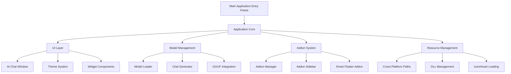

# Design Document

## Overview

The GGUF Loader is architected as a modular desktop application built with PySide6 (Qt for Python) that provides a local AI chat interface with an extensible addon system. The application follows a mixin-based architecture for the main window, uses a plugin system for addons, and implements cross-platform compatibility through resource management and platform detection.

## Architecture

### High-Level Architecture



### Application Entry Points

The application provides multiple entry points:
- `main.py`: Basic GGUF Loader without addon support
- `gguf_loader_main.py`: Full GGUF Loader with addon system
- `launch.py`: Cross-platform launcher with environment setup
- Command-line interface with version and help options

### Core Architecture Patterns

1. **Mixin Pattern**: The main `AIChat` window inherits from multiple mixins for separation of concerns
2. **Plugin Architecture**: Addons are dynamically loaded modules with a standard `register()` function
3. **Resource Management**: Platform-aware resource loading and path resolution
4. **Signal-Slot Communication**: Qt signals for loose coupling between components

## Components and Interfaces

### 1. Application Core (`main.py`, `gguf_loader_main.py`)

**Purpose**: Application initialization, platform setup, and main window creation

**Key Responsibilities**:
- Platform-specific DLL/library path configuration
- Application icon and metadata setup
- Main window instantiation and lifecycle management
- Command-line argument processing

**Interfaces**:
```python
def add_dll_folder() -> None
def main() -> None
```

### 2. AI Chat Window (`ui/ai_chat_window.py`)

**Purpose**: Main application window combining all functionality through mixins

**Architecture**: Multiple inheritance from mixins:
- `ThemeMixin`: Dark/light theme support
- `UISetupMixin`: UI layout and widget creation
- `ModelHandlerMixin`: Model loading and management
- `ChatHandlerMixin`: Chat functionality and conversation management
- `EventHandlerMixin`: User input and event processing
- `UtilsMixin`: Utility functions and helpers

**Key Signals**:
```python
model_loaded = Signal(object)
generation_finished = Signal()
generation_error = Signal(str)
```

### 3. Model Management System

#### Model Loader (`models/model_loader.py`)
**Purpose**: GGUF model file loading and validation

**Key Responsibilities**:
- GGUF file format validation
- Model metadata extraction
- Memory management for model loading/unloading
- Error handling for invalid or corrupted models

#### Chat Generator (`models/chat_generator.py`)
**Purpose**: AI response generation using loaded models

**Key Responsibilities**:
- Prompt formatting and context management
- Streaming response generation
- Generation parameter application (temperature, max_tokens, etc.)
- Conversation history management

### 4. Addon System

#### Addon Manager (`addon_manager.py`)
**Purpose**: Dynamic addon discovery, loading, and lifecycle management

**Key Components**:
```python
class AddonManager:
    def scan_addons() -> Dict[str, str]
    def load_addon(addon_name: str, addon_path: str) -> bool
    def get_addon_widget(addon_name: str, parent=None) -> Optional[QWidget]
    def open_addon_dialog(addon_name: str, parent=None) -> None
```

#### Addon Sidebar (`addon_manager.py`)
**Purpose**: UI component for addon management and activation

**Features**:
- Automatic addon discovery and button creation
- Popup dialog management for addon interfaces
- Refresh functionality for addon reloading

#### Smart Floater Addon (`addons/smart_floater/`)
**Purpose**: Global text selection processing with AI

**Architecture**:
```python
class SmartFloaterAddon(QObject):
    def start() -> bool
    def stop() -> bool
    def _check_text_selection() -> None
    def _show_floating_button() -> None
    def _show_popup() -> None
    def _process_text(action: str) -> None
```

### 5. Configuration System (`config.py`)

**Purpose**: Centralized configuration management with multilingual support

**Key Features**:
- Persian/English bilingual support
- System prompt templates
- Generation parameter presets
- UI localization strings
- Platform-specific settings
- Color schemes and themes

### 6. Resource Management (`resource_manager.py`)

**Purpose**: Cross-platform resource loading and path resolution

**Key Functions**:
```python
def find_icon(filename: str) -> str
def get_dll_path() -> str
def find_addons_dir() -> str
def get_resource_path(resource_name: str) -> str
```

### 7. UI Components and Widgets

#### Theme System (`ui/apply_style.py`)
**Purpose**: Dynamic theme switching and style application

#### Widget Library (`widgets/`)
- `chat_bubble.py`: Chat message display components
- `collapsible_widget.py`: Expandable UI sections
- `addon_sidebar.py`: Addon management interface

#### Mixins (`mixins/`)
- `ui_setup_mixin.py`: Main UI layout and widget creation
- `model_handler_mixin.py`: Model loading and management logic
- `chat_handler_mixin.py`: Chat functionality and message handling
- `event_handler_mixin.py`: User input and event processing
- `utils_mixin.py`: Utility functions and helpers

## Data Models

### 1. Conversation Management

```python
# Conversation history structure
conversation_history = [
    {
        "role": "user",
        "content": "User message text",
        "timestamp": datetime,
        "metadata": {}
    },
    {
        "role": "assistant", 
        "content": "AI response text",
        "timestamp": datetime,
        "metadata": {
            "model": "model_name",
            "generation_params": {},
            "processing_time": float
        }
    }
]
```

### 2. Model Information

```python
# Model metadata structure
model_info = {
    "name": str,
    "path": str,
    "size": int,
    "context_length": int,
    "architecture": str,
    "quantization": str,
    "loaded": bool,
    "load_time": float
}
```

### 3. Addon Registration

```python
# Addon interface contract
def register(parent=None) -> Optional[QWidget]:
    """
    Addon entry point called by addon manager
    
    Args:
        parent: Main application window instance
        
    Returns:
        Widget for sidebar integration or None for background addons
    """
    pass
```

### 4. Configuration Schema

```python
# Configuration structure
config = {
    "ui_settings": {
        "theme": str,
        "language": str,
        "font_family": str,
        "font_size": int
    },
    "model_settings": {
        "default_model_path": str,
        "context_length": int,
        "generation_params": {
            "temperature": float,
            "max_tokens": int,
            "top_p": float,
            "top_k": int
        }
    },
    "addon_settings": {
        "enabled_addons": List[str],
        "addon_configs": Dict[str, Dict]
    }
}
```

## Error Handling

### 1. Error Categories

**Model Loading Errors**:
- File not found or inaccessible
- Invalid GGUF format
- Insufficient memory
- Corrupted model files

**Generation Errors**:
- Model not loaded
- Context length exceeded
- Generation timeout
- Invalid parameters

**Addon Errors**:
- Addon loading failures
- Missing dependencies
- Runtime exceptions
- API compatibility issues

**System Errors**:
- Platform compatibility issues
- Resource access problems
- Configuration errors

### 2. Error Handling Strategy

```python
# Centralized error handling pattern
try:
    # Operation
    result = perform_operation()
except SpecificException as e:
    logger.error(f"Specific error: {e}")
    # Handle specific case
    return handle_specific_error(e)
except Exception as e:
    logger.error(f"Unexpected error: {e}")
    # Graceful degradation
    return handle_generic_error(e)
```

### 3. User Error Communication

- Clear, actionable error messages
- Suggested solutions and troubleshooting steps
- Graceful degradation when possible
- Comprehensive logging for debugging

## Testing Strategy

### 1. Unit Testing

**Model Management**:
- Model loading with valid/invalid files
- Generation parameter validation
- Memory management and cleanup

**Addon System**:
- Addon discovery and loading
- Error handling for malformed addons
- API compatibility testing

**Configuration**:
- Settings persistence and loading
- Language switching functionality
- Theme application

### 2. Integration Testing

**End-to-End Workflows**:
- Complete chat conversations
- Model switching during active chats
- Addon activation and deactivation
- Cross-platform compatibility

**UI Testing**:
- Theme switching
- Responsive layout behavior
- Keyboard shortcuts and accessibility

### 3. Platform Testing

**Windows**:
- DLL loading and path resolution
- Executable packaging and distribution
- Windows-specific UI behaviors

**Linux**:
- Library path configuration
- Package manager integration
- Desktop environment compatibility

**macOS**:
- Framework loading
- Application bundle creation
- macOS-specific UI guidelines

### 4. Performance Testing

**Model Loading**:
- Large model file handling
- Memory usage optimization
- Loading time benchmarks

**Generation Performance**:
- Response time measurement
- Memory usage during generation
- Concurrent request handling

**Addon Performance**:
- Smart Floater text selection monitoring
- UI responsiveness with multiple addons
- Resource usage optimization

### 5. Security Testing

**Local Processing**:
- Verification of offline operation
- Data privacy and local storage
- No external network communication

**Addon Security**:
- Addon sandboxing and isolation
- API access control
- Malicious addon protection