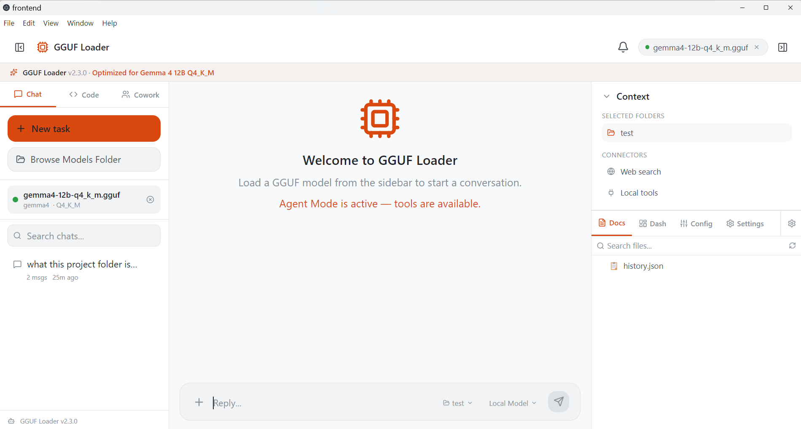
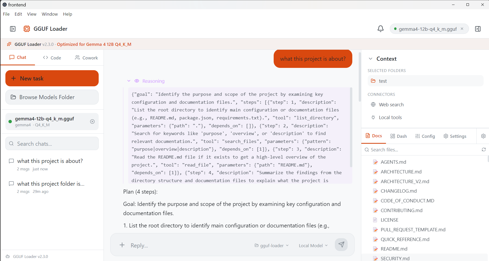
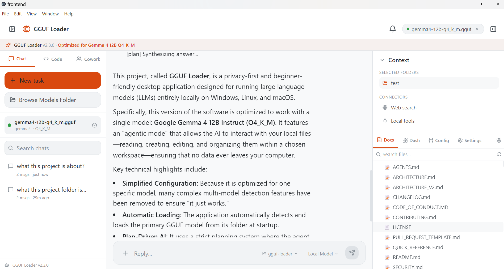

# GGUF Loader

[](https://pypi.org/project/ggufloader/)
[](https://pypi.org/project/ggufloader/)
[](https://pypi.org/project/ggufloader/)


A privacy-first, beginner-friendly desktop application for running GGUF
language models **fully locally** on Windows, Linux, and macOS. GGUF Loader is
a **universal model loader** — you pick the model that fits your PC's
resources. It ships with a built-in **agentic mode** that can read, create,
edit, and organize files in a workspace you choose. No data ever leaves your
computer.

> 🧪 **Note:** the new v2.3.0 testing release is temporarily optimized for
> one model (Gemma 4 12B Instruct Q4_K_M) so its agentic work runs well —
> universal model support returns in the next release.

> 📦 **Also available as a Python package** — install it in seconds with
> `pip install ggufloader` and launch it with `ggufloader`.
> [View on PyPI](https://pypi.org/project/ggufloader/)

> ⚠️ **Testing Release Notice**
> **This version (2.3.0) is a testing/preview release.** It is locked to a
> single model (Gemma 4 12B Instruct Q4_K_M) while we validate the new
> plan-driven agent. Expect rough edges, and please
> [report issues](https://github.com/GGUFloader/gguf-loader/issues) you find.
>
> 🔮 **Coming in the next release — Universal Model Loader**
> We are working on removing the single-model restriction so the agent works
> with **any GGUF model you choose**. The universal loader will detect your
> PC's capabilities (RAM, VRAM, CPU/GPU) and recommend models that fit your
> hardware — so you can run anything from small 3B models on modest machines
> to large 70B+ models on high-end rigs. Stay tuned!

---

## What's New in 2.3.0 - the single-model agent build (testing)

- **One model, zero config (temporary)** - this testing release is optimized for **Gemma 4 12B Instruct Q4_K_M**; multi-model detection was temporarily removed so this one model just works. Universal loading returns next release.
- **Auto-load at startup** - the app scans its `models/` folder (plus the last-used model folder) and loads the pinned GGUF automatically; if it is missing, the header model chip downloads it with live progress. The manual Load Model step is gone.
- **Strictly plan-driven agent** - every agent turn goes through a planner node: no tools needed, the model answers directly; tools needed, a plan is written and executed step by step. The reactive ReAct fallback was removed.
- **Codebuff-style process UI** - plan steps, tool calls, and results render inline in the chat above each answer; the old right-hand progress panel is gone.
- **Reliable final answers** - stray tool-call JSON envelopes are scrubbed from the live stream and the final reply, and wait-status text such as "Planning..." never sticks in the timeline.
- **Pruned tools** - the default registry is the 10 workspace tools the agent actually uses (memory/meta tools removed), and searches are hardened against huge generated folders.
- **Self-setup launchers** - `launch.bat` / `launch.sh` offer browser, Electron, and production modes and install Python + Node dependencies.

Older notes below and in [CHANGELOG.md](CHANGELOG.md); Qt-era history lives in docs marked as historical.

---
## 🆕 What's New in 2.2.0

- **Collision-proof pip package** — the entire app now ships inside a single
  `ggufloader` package, so `pip install ggufloader` is safe even in shared or
  global Python environments where other packages live (no more top-level
  `config`/`utils`/`core` name clashes, no dependency mismatch: the tested
  dependency set is pinned).
- **Mature Agentic Mode** — LangGraph-driven multi-step agent with 7 sandboxed
  tools, a live transcript panel, **Allow/Deny approval cards** for shell
  commands and git writes, and SQLite checkpointing so each workspace's
  conversation survives restarts and resumes where you left off.
- **Find Paragraph (no-RAG search)** — ask a question and locate the exact
  paragraph in a document or a whole folder, with a planner that decides what
  to read and live per-file progress.
- **Full-folder summaries** — "summarize this folder" now reads **every**
  readable file (Markdown, PDF, DOCX, TXT, code) before answering, with a
  "Reading remaining files…" status so you always know what's happening.
- **One-click GPU support** — an **Install GPU Support** button in the UI that
  installs the CUDA-enabled build for you and shows a green tick when GPU
  acceleration is ready.

---

## ✨ Features

### Interface

- 🗂️ **Sessions left, chat center, tools right** - sessions (left), the chat with the inline agent process (center), and tool panels - Files, Dashboard, Templates, Search, Workspaces - (right)
- 💬 **Streaming chat** - token-by-token delivery via WebSocket
- 🤖 **Agent mode** - planner-driven runs with Allow/Deny approvals, streamed inline in the chat
- 📥 **Model chip in the header** - shows load state; downloads the pinned Gemma 4 12B Q4_K_M GGUF with live progress when it is missing
- ⚙️ **Settings dialog** - Model, Providers, Agent, Hardware, Appearance, Keyboard, Plugins tabs
- 🎨 **Theme** - dark/light mode, accent colors, font size
- ⌨️ **Command palette & shortcuts** - Ctrl/Cmd+K, Ctrl/Cmd+Shift+A (agent mode), Ctrl/Cmd+Shift+[ / ] (panels), Ctrl/Cmd+1/2/3
- 📱 **Electron** - standalone desktop app (no browser needed)

### Core Features

- 🤖 **Plan-driven agent (LangGraph)** - a planner node decides each turn: tool-free questions are answered directly; tasks get a step-by-step plan that runs with sandboxed tools (list/read/write/edit/move/search files, shell commands, code, git) inside the workspace you grant - with Allow/Deny approval for commands, code, and git writes, and SQLite checkpointing so conversations resume after restarts.
- 🔎 **Advanced Search (Find Paragraph)** - locate a passage in a document or folder with the model itself, no RAG or vector database required.
- 🧾 **Real file reading** - extracts text from `.md`, `.pdf`, `.docx`, `.txt` and source files, so the agent can summarize and answer from real content.
- 🎯 **Single-model focus (testing release)** - v2.3.0 temporarily loads exactly Gemma 4 12B Q4_K_M, tuned so its agentic work runs well; other GGUFs are rejected with a clear message. Universal model support returns in the next release.
- ⚡ **GPU acceleration** - enable it under **Settings -> Hardware** (it installs the CUDA/Metal build with live status); the app then uses the GPU for inference.
- 📋 **Process you can follow** - agent runs stream their plan, tool calls, and results inline in the chat, Codebuff-style.
- 🔒 **Privacy first** - 100% local inference. Your prompts and files never leave your machine.
- 💻 **Cross-platform** - Windows 10/11, Linux, and macOS (including Apple Silicon), via React + Electron or in the browser.

## 🎬 Screenshots







---

## 🚀 Quick Start

### Option 1: Install via pip (recommended)

```bash
pip install ggufloader
ggufloader
```

That's it — the app opens. Requires **Python 3.10–3.13**.

The package is published on [PyPI](https://pypi.org/project/ggufloader/) —
update it any time with `pip install --upgrade ggufloader`.

The wheel installs only the `ggufloader` name into your environment, so it
works perfectly in a global Python install alongside other packages — nothing
gets overwritten, and the dependency set is pinned to the exact combination
that is tested to install and boot together on all three platforms.

### Option 2: Run from source

```bash
git clone https://github.com/GGUFloader/gguf-loader.git
cd gguf-loader
python -m venv .venv
.venv\Scripts\activate        # Windows (or: source .venv/bin/activate)
pip install -r requirements.txt
python main.py
```

Windows/Linux users can also run `launch.bat` / `launch.sh` from the extracted
ZIP (keep `launch.sh` executable after extraction). The scripts create a
virtualenv, check every dependency, and install anything missing — on Linux
`llama-cpp-python` is pulled from abetlen's prebuilt CPU wheel index, so no C
compiler is required. They need Python 3.10+ (on Debian/Ubuntu also
`python3-venv` or `virtualenv`); any missing piece is reported with a clear,
actionable message.

### Option 3: Prebuilt executable

Standalone one-file executables are published on the
[GitHub Releases](https://github.com/GGUFloader/gguf-loader/releases) page:

| Artifact | Size | Notes |
|---|---|---|
| `GGUFLoader_v<version>_CUDA.exe` | ~930 MB | Windows · NVIDIA CUDA, zero setup |
| `GGUFLoader_v<version>_CPU.exe` | ~145 MB | Windows · CPU-only, works everywhere |
| `GGUFLoader_v<version>_linux_x86_64_CPU` | ~50 MB | Linux · CPU-only |
| `GGUFLoader_v<version>_linux_x86_64_CUDA` | ~1.35 GB | Linux · NVIDIA CUDA (driver ≥ 550) |

The CUDA build bundles the full CUDA runtime; the CPU build drops it entirely,
which is why it is several times smaller. Pick the CUDA build if you have an
NVIDIA card (driver ≥ 550 on Linux), the CPU build otherwise.

### First launch

1. Start the app - it **auto-loads** the pinned Gemma 4 12B Q4_K_M GGUF from the `models/` folder (or the last-used model folder) in the background.
2. No model on disk? The **model chip in the header** downloads it with live progress and loads it when finished.
3. Chat in the main window, or press **Ctrl/Cmd + Shift + A** for Agent Mode and choose a workspace folder.

## 🤖 Agentic Mode

Agentic Mode turns the local model into a working assistant for a folder you
choose (your project, a documentation set, any workspace). It plans multi-step
tasks, calls tools, and streams every step live.

### Tools

| Tool | What it does |
|---|---|
| `list_directory` / `glob` | Explore folders and match file paths in the workspace |
| `read_file` | Read any file (MD/PDF/DOCX/TXT/code - text extracted automatically) |
| `search_files` | Find files and grep for content |
| `write_file` / `edit_file` / `move_file` | Create, edit, and move files |
| `run_command` | Run a shell command inside the workspace (approval-gated) |
| `run_python` | Execute Python source inside the workspace (approval-gated) |
| `git` | Git operations - read-only runs freely, writes require approval |

### Human approval

Shell commands, code execution, and git writes are sensitive, so they pause for an **Allow / Deny** card and the run waits for your choice. Everything else (reading, searching, file edits) runs automatically.

### Inline process

Each agent turn renders inline in the chat: the plan's steps, every tool call with its result, and status lines appear above the answer as the run happens, Codebuff-style. Runs are checkpointed (SQLite), so state survives restarts, and a step budget keeps runaway loops in check.

### Example tasks

- "Summarize the Day 4 folder" → reads all 5 files (MD + PDF + DOCX) and gives a real summary
- "Create a new feature module with proper structure"
- "Refactor this codebase and organize files"
- "Find where `MAX_TOKENS` is defined and explain it"

---

## 🔎 Advanced Search (Find Paragraph, no RAG)

Open the **Advanced Search** panel (magnifier icon in the right-hand panel) to locate a specific passage in a document or across a folder:

**Single file** — type a question ("what does it say about control flow?")
  and the model finds and ranks the matching paragraphs.
- **Folder search** — a planner decides which files to look at and in what
  order (using only read-only tools), with a live per-file scan counter.
- **Smart defaults** — your last query, source, folder, pattern, and
  exhaustive-search setting are remembered between sessions.

No vector database, no embeddings — just the model reading the text and
finding the answer.

---

## ⚡ GPU Acceleration

The pip-installed app runs on CPU by default. To speed up inference with an
NVIDIA GPU:

1. Open **Settings -> Hardware** and click the GPU install option.
2. The app installs the CUDA-enabled `llama-cpp-python` build into your current Python environment (you'll see progress, then a green check when it is done).
3. Restart the app. Settings then shows a **green tick** ("GPU support is installed") and inference uses the GPU - no CPU+GPU mixing, just the GPU.

For manual control you can also run the bundled scripts:
`scripts/install_gpu_llama.bat` (Windows) / `scripts/install_gpu_llama.sh`
(Linux/macOS), and verify with `python scripts/verify_gpu_support.py`.

---

## 📥 Supported Model

| Model | Size | Notes |
|---|---|---|
| **Gemma 4 12B Instruct (Q4_K_M)** | ~8 GB | The model this testing release loads — sampling, context and prompts are tuned for it |

GGUF Loader itself is a **universal model loader** — historically it accepted
any GGUF model, and it will again. The v2.3.0 testing release is temporarily
pinned to Gemma 4 12B Instruct Q4_K_M (auto-downloaded on first launch) while
the new agent architecture is validated. Grab it from
[Hugging Face](https://huggingface.co/models?library=gguf&query=gemma+4+12b).

> 🔮 **Next release:** the **Universal Model Loader** returns — any GGUF
> model will work, with hardware-aware recommendations so you can pick a
> model that fits your PC's RAM/VRAM (small 3B models on modest machines up
> to 70B+ on high-end rigs).

---

## 🛠️ System Requirements

- **Python:** 3.10–3.13 (pip install)
- **OS:** Windows 10/11, Linux, macOS (Intel & Apple Silicon)
- **RAM:** 8 GB minimum for the 12B model (16 GB recommended)
- **Storage:** ~8 GB free for the model file
- **GPU:** Optional — NVIDIA CUDA on Windows/Linux, Metal on macOS

## 📦 Dependencies

The wheel declares its dependencies pinned to the exact set verified to work
together, so `pip install ggufloader` resolves the same tested combination
every time — no dependency mismatch, and every package has prebuilt wheels for
all three platforms:

`llama-cpp-python` (CPU by default) · `langgraph` ·
`langgraph-checkpoint-sqlite` · `langchain-core` · `fastapi` · `uvicorn` ·
`pydantic`

(The legacy PySide6 desktop UI is no longer shipped or installed - the React app running in Electron is the only UI, so the installer contains just the Python backend plus the Electron/React frontend.)

---

## 🧱 Building from source

- **Wheel / sdist:** `pip install build && python -m build` → artifacts in `dist/`
- **Windows executable:** `scripts/build_exe.bat` (or `python -m PyInstaller
  build_exe.spec`). The script detects whether the installed llama-cpp-python
  is CUDA-enabled and names the output `GGUFLoader_v<version>_CUDA.exe` or
  `GGUFLoader_v<version>_CPU.exe` automatically.
- **Linux executable:** `scripts/build_linux.sh` — must run on Linux (or WSL);
  produces `GGUFLoader_v<version>_linux_x86_64_CPU`. One-file binaries are not
  cross-platform.
- **Tests:** `pip install pytest && python -m pytest`

## 📚 Documentation

- [Quick Reference](QUICK_REFERENCE.md)
- [Developing Addons](ggufloader/addons/README.md)
- [AGENTS.md](AGENTS.md) — codebase guide for AI coding agents
- [Docs archive (v2.1.2)](docs/README.md) — historical documentation restored from git history
- [Architecture](ARCHITECTURE.md)
- [Changelog](CHANGELOG.md)
- [Contributing](CONTRIBUTING.md)
- [Security Policy](SECURITY.md)

---

## 🤝 Contributing

Contributions are welcome! See [CONTRIBUTING.md](CONTRIBUTING.md).

## 📄 License

MIT — see [LICENSE](LICENSE).

## 🔒 Security

Report vulnerabilities to hussainnazary475@gmail.com or see
[SECURITY.md](SECURITY.md).

## 📞 Support

- 🐛 [Report Issues](https://github.com/GGUFloader/gguf-loader/issues)
- 💬 [Discussions](https://github.com/GGUFloader/gguf-loader/discussions)
- 📧 hussainnazary475@gmail.com

---

**Built with ❤️ by the GGUF Loader community**
