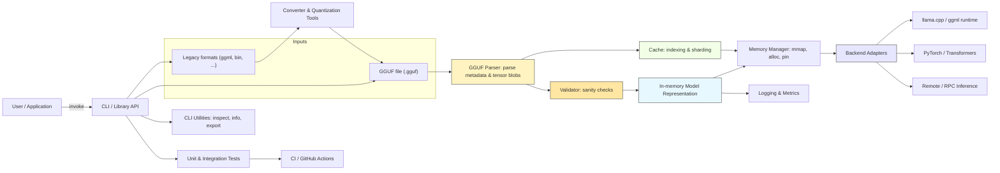

📄 **Machine-readable metadata available**  
- [metadata.json](./metadata.json)  
- [meta.yaml](./meta.yaml)

# GGUF Loader


[](https://pypi.org/project/ggufloader/)
[](https://pypi.org/project/ggufloader/)
[](https://pypi.org/project/ggufloader/)
[](https://pepy.tech/projects/ggufloader)


---

with its floating button A beginner-friendly, privacy-first desktop application for running large language models locally on Windows, Linux, and macOS. Load and chat with GGUF format models like Mistral, LLaMA, DeepSeek, and others with zero setup required. Features an extensible addon system including a Smart Floating Assistant that works globally across all applications.
# GGUF Loader

A beginner-friendly, privacy-first desktop application for running large language models locally on Windows, Linux, and macOS. Load and chat with GGUF format models like Mistral, LLaMA, DeepSeek, and others with zero setup required. Features an extensible addon system including a Smart Floating Assistant that works globally across all applications.

<!-- Floating button: links to the architecture diagram below.
     Note: GitHub sanitizes some inline styles; the anchor still works as a link. -->
<a href="#architecture" title="View architecture diagram" style="position:fixed;right:18px;bottom:18px;z-index:1000;background:#2563EB;color:#fff;padding:10px 14px;border-radius:999px;text-decoration:none;box-shadow:0 6px 18px rgba(0,0,0,0.18);font-weight:600;display:inline-block">Architecture</a>

## Architecture

<a id="architecture"></a>



Key components
- CLI / Library API: primary entrypoint (CLI + programmatic API).
- GGUF Parser: reads .gguf, extracts metadata and tensor blobs.
- Converter & Quantization Tools: convert legacy formats into GGUF and apply quantization.
- Validator: sanity checks for shapes, metadata, and integrity.
- Model Representation & Memory Manager: in-memory model objects with efficient allocation (mmap/pinned).
- Cache & Indexing: optional on-disk indices and sharding for large models.
- Backend Adapters: integrations for runtimes (llama.cpp/ggml, PyTorch, remote RPC).
- Observability & CI: logging, metrics, tests, and CI.
## Download EXE file for Windows
[](https://github.com/GGUFloader/gguf-loader/releases/download/v2.0.1/GGUFLoader.2.0.1.exe
)


## 🚀 Quick Start

### Easy Launch (Recommended)

For the best experience, use the provided launch scripts that automatically handle environment setup:

#### Windows
```bash
# Full GGUF Loader with addon support
launch.bat

# Basic chatbot without addons  
launch_basic.bat
```

#### Linux/macOS
```bash
# Full GGUF Loader with addon support
./launch.sh

# Basic chatbot without addons
./launch_basic.sh
```

### Alternative: Install via pip

```bash
pip install ggufloader
ggufloader
```
## 🧩 🎬 Demo Video: Addon System + Floating Tool in Local LLM (v2.0.1 Update)

[](https://www.youtube.com/watch?v=5lQui7EeUe0)


> Discover how to supercharge your local AI workflows using the new floating addon system! No coding needed. Works offline.


Works on Windows, Linux, and macOS
## 🔽 Download GGUF Models

> ⚡ Click a link below to download the model file directly (no Hugging Face page in between).
### 🧠 GPT-OSS Models (Open Source GPTs)

> High-quality, Apache 2.0 licensed, reasoning-focused models for local/enterprise use.

#### 🧠 GPT-OSS 120B (Dense)

- [⬇️ Download Q4_K (46.2 GB)](https://huggingface.co/lmstudio-community/gpt-oss-120b-GGUF/resolve/main/gpt-oss-120b-MXFP4-00001-of-00002.gguf)


#### 🧠 GPT-OSS 20B (Dense)

- [⬇️ Download Q4_K (7.34 GB)](https://huggingface.co/lmstudio-community/gpt-oss-20b-GGUF/resolve/main/gpt-oss-20b-MXFP4.gguf)


---
### 🧠 Mistral-7B Instruct

- [⬇️ Download Q4_0 (4.23 GB)](https://huggingface.co/TheBloke/Mistral-7B-Instruct-v0.1-GGUF/resolve/main/mistral-7b-instruct-v0.1.Q4_0.gguf)
- [⬇️ Download Q6_K (6.23 GB)](https://huggingface.co/TheBloke/Mistral-7B-Instruct-v0.1-GGUF/resolve/main/mistral-7b-instruct-v0.1.Q6_K.gguf)

### 🧠 Qwen 1.5-7B Chat

- [⬇️ Download Q4_K (4.88 GB)](https://huggingface.co/TheBloke/Qwen1.5-7B-Chat-GGUF/resolve/main/qwen1_5-7b-chat-q4_k.gguf)
- [⬇️ Download Q6_K (6.83 GB)](https://huggingface.co/TheBloke/Qwen1.5-7B-Chat-GGUF/resolve/main/qwen1_5-7b-chat-q6_k.gguf)

### 🧠 DeepSeek 7B Chat

- [⬇️ Download Q4_0 (4.87 GB)](https://huggingface.co/TheBloke/DeepSeek-7B-Chat-GGUF/resolve/main/deepseek-7b-chat.Q4_0.gguf)
- [⬇️ Download Q8_0 (9.33 GB)](https://huggingface.co/TheBloke/DeepSeek-7B-Chat-GGUF/resolve/main/deepseek-7b-chat.Q8_0.gguf)

### 🧠 LLaMA 3 8B Instruct

- [⬇️ Download Q4_0 (4.68 GB)](https://huggingface.co/TheBloke/Llama-3-8B-Instruct-GGUF/resolve/main/llama-3-8b-instruct.Q4_0.gguf)
- [⬇️ Download Q6_K (6.91 GB)](https://huggingface.co/TheBloke/Llama-3-8B-Instruct-GGUF/resolve/main/llama-3-8b-instruct.Q6_K.gguf)


---

### 🗂️ More Model Collections

- [🧠 TheBloke’s GGUF Model Collection](https://local-ai-zone.github.io)
- [🌍 GGUF Community Collection](https://local-ai-zone.github.io)

## Development Roadmap

| **Phase** | **Timeline** | **Status** | **Key Milestones & Features** |
|----------|--------------|------------|--------------------------------|
| **Phase 1: Core Foundation** | ✅ Q3 2025 | 🚀 In Progress | - Zero-setup installer<br>- Offline model loading (GGUF)<br>- Intuitive GUI (PySide6)<br>- Built-in tokenizer viewer<br>- Basic file summarizer (TXT/PDF) |
| **Phase 2: Addon Ecosystem** | 🔄 Q3–Q4 2025 | 🧪 In Development | - Addon manager + sidebar UI (✅ started)<br>- Addon popup architecture<br>- Example addon templates<br>- Addon activation/deactivation<br>- Addon SDK for easy integration |
| **Phase 3: Power User Features** | Q4 2025 | 📋 Planned | - GPU acceleration (Auto/Manual)<br>- Model browser + drag-and-run<br>- Prompt builder with reusable templates<br>- Dark/light theme toggle |
| **Phase 4: AI Automation Toolkit** | Q4 2025 – Q1 2026 | 🔬 Research | - RAG pipeline (Retrieval-Augmented Generation)<br>- Multi-document summarization<br>- Contract/book intelligence<br>- Agent workflows (write → summarize → reply) |
| **Phase 5: Cross-Platform & Sync** | 2026 | 🎯 Vision | - macOS and Linux support<br>- Auto-updating model index<br>- Cross-device config sync<br>- Voice command system (whisper.cpp integration) |
| **Phase 6: Public Ecosystem** | 2026+ | 🌐 Long-Term | - Addon marketplace <br>- Addon rating and discovery<br>- Developer CLI & SDK<br>- Community themes, extensions, and templates |


# GGUF Loader Documentation

Welcome to GGUF Loader! This documentation will help you get started and make the most of the application.

## 📚 Documentation

### For Users
- **[Installation Guide](installation.md)** - How to install GGUF Loader
- **[User Guide](user-guide.md)** - Complete guide to using the application
- **[FAQ](faq.md)** - Frequently asked questions

### For Developers
- **[Addon Development](addon-development.md)** - Create custom addons
- **[Feedback System](feedback-system.md)** - Set up user feedback
- **[Contributing](../CONTRIBUTING.md)** - How to contribute to the project

### Additional Resources
- **[Security Policy](../SECURITY.md)** - Security and vulnerability reporting
- **[Code of Conduct](../CODE_OF_CONDUCT.MD)** - Community guidelines
- **[Release Notes](../RELEASE_NOTES.md)** - What's new in each version

## 🚀 Quick Start

1. **Install:** Download the [Windows executable](https://github.com/GGUFloader/gguf-loader/releases) or run `pip install ggufloader`
2. **Download a model:** Get a GGUF model from [Hugging Face](https://huggingface.co/models?library=gguf)
3. **Load and chat:** Open GGUF Loader, load your model, and start chatting!

## 💡 Key Features

- 🤖 **Local AI** - Run models completely offline
- 🎨 **Modern UI** - Clean, intuitive interface
- 🔌 **Addons** - Extend functionality with custom addons
- 🌐 **Smart Floater** - Process text globally across all apps
- 🔒 **Privacy** - All processing happens locally

## 📞 Getting Help

- 📖 Read the [User Guide](user-guide.md)
- 🐛 [Report Issues](https://github.com/GGUFloader/gguf-loader/issues)
- 💬 [Join Discussions](https://github.com/GGUFloader/gguf-loader/discussions)
- 📧 Email: hossainnazary475@gmail.com

---

**Built with ❤️ by the GGUF Loader community**
