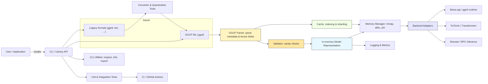

📄 **Machine-readable metadata available**  
- [metadata.json](./metadata.json)  
- [meta.yaml](./meta.yaml)

# GGUF Loader


[](https://pypi.org/project/ggufloader/)
[](https://pypi.org/project/ggufloader/)
[](https://pypi.org/project/ggufloader/)
[](https://pepy.tech/projects/ggufloader)


---

with its floating button A beginner-friendly, privacy-first desktop application for running large language models locally on Windows, Linux, and macOS. Load and chat with GGUF format models like Mistral, LLaMA, DeepSeek, and others with zero setup required. Features an extensible addon system including a Smart Floating Assistant that works globally across all applications.
# GGUF Loader

A beginner-friendly, privacy-first desktop application for running large language models locally on Windows, Linux, and macOS. Load and chat with GGUF format models like Mistral, LLaMA, DeepSeek, and others with zero setup required. Features an extensible addon system including a Smart Floating Assistant that works globally across all applications.

<!-- Floating button: links to the architecture diagram below.
     Note: GitHub sanitizes some inline styles; the anchor still works as a link. -->
<a href="#architecture" title="View architecture diagram" style="position:fixed;right:18px;bottom:18px;z-index:1000;background:#2563EB;color:#fff;padding:10px 14px;border-radius:999px;text-decoration:none;box-shadow:0 6px 18px rgba(0,0,0,0.18);font-weight:600;display:inline-block">Architecture</a>

## Architecture

<a id="architecture"></a>



Key components
- CLI / Library API: primary entrypoint (CLI + programmatic API).
- GGUF Parser: reads .gguf, extracts metadata and tensor blobs.
- Converter & Quantization Tools: convert legacy formats into GGUF and apply quantization.
- Validator: sanity checks for shapes, metadata, and integrity.
- Model Representation & Memory Manager: in-memory model objects with efficient allocation (mmap/pinned).
- Cache & Indexing: optional on-disk indices and sharding for large models.
- Backend Adapters: integrations for runtimes (llama.cpp/ggml, PyTorch, remote RPC).
- Observability & CI: logging, metrics, tests, and CI.
## Download EXE file for Windows
[](https://github.com/GGUFloader/gguf-loader/releases/download/v2.0.1/GGUFLoader.2.0.1.exe
)


## 🚀 Quick Start

### Easy Launch (Recommended)

For the best experience, use the provided launch scripts that automatically handle environment setup:

#### Windows
```bash
# Full GGUF Loader with addon support
launch.bat

# Basic chatbot without addons  
launch_basic.bat
```

#### Linux/macOS
```bash
# Full GGUF Loader with addon support
./launch.sh

# Basic chatbot without addons
./launch_basic.sh
```

### Alternative: Install via pip

```bash
pip install ggufloader
ggufloader
```
## 🧩 🎬 Demo Video: Addon System + Floating Tool in Local LLM (v2.0.1 Update)

[](https://www.youtube.com/watch?v=5lQui7EeUe0)


> Discover how to supercharge your local AI workflows using the new floating addon system! No coding needed. Works offline.


Works on Windows, Linux, and macOS
## 🔽 Download GGUF Models

> ⚡ Click a link below to download the model file directly (no Hugging Face page in between).
### 🧠 GPT-OSS Models (Open Source GPTs)

> High-quality, Apache 2.0 licensed, reasoning-focused models for local/enterprise use.

#### 🧠 GPT-OSS 120B (Dense)

- [⬇️ Download Q4_K (46.2 GB)](https://huggingface.co/lmstudio-community/gpt-oss-120b-GGUF/resolve/main/gpt-oss-120b-MXFP4-00001-of-00002.gguf)


#### 🧠 GPT-OSS 20B (Dense)

- [⬇️ Download Q4_K (7.34 GB)](https://huggingface.co/lmstudio-community/gpt-oss-20b-GGUF/resolve/main/gpt-oss-20b-MXFP4.gguf)


---
### 🧠 Mistral-7B Instruct

- [⬇️ Download Q4_0 (4.23 GB)](https://huggingface.co/TheBloke/Mistral-7B-Instruct-v0.1-GGUF/resolve/main/mistral-7b-instruct-v0.1.Q4_0.gguf)
- [⬇️ Download Q6_K (6.23 GB)](https://huggingface.co/TheBloke/Mistral-7B-Instruct-v0.1-GGUF/resolve/main/mistral-7b-instruct-v0.1.Q6_K.gguf)

### 🧠 Qwen 1.5-7B Chat

- [⬇️ Download Q4_K (4.88 GB)](https://huggingface.co/TheBloke/Qwen1.5-7B-Chat-GGUF/resolve/main/qwen1_5-7b-chat-q4_k.gguf)
- [⬇️ Download Q6_K (6.83 GB)](https://huggingface.co/TheBloke/Qwen1.5-7B-Chat-GGUF/resolve/main/qwen1_5-7b-chat-q6_k.gguf)

### 🧠 DeepSeek 7B Chat

- [⬇️ Download Q4_0 (4.87 GB)](https://huggingface.co/TheBloke/DeepSeek-7B-Chat-GGUF/resolve/main/deepseek-7b-chat.Q4_0.gguf)
- [⬇️ Download Q8_0 (9.33 GB)](https://huggingface.co/TheBloke/DeepSeek-7B-Chat-GGUF/resolve/main/deepseek-7b-chat.Q8_0.gguf)

### 🧠 LLaMA 3 8B Instruct

- [⬇️ Download Q4_0 (4.68 GB)](https://huggingface.co/TheBloke/Llama-3-8B-Instruct-GGUF/resolve/main/llama-3-8b-instruct.Q4_0.gguf)
- [⬇️ Download Q6_K (6.91 GB)](https://huggingface.co/TheBloke/Llama-3-8B-Instruct-GGUF/resolve/main/llama-3-8b-instruct.Q6_K.gguf)


---

### 🗂️ More Model Collections

- [🧠 TheBloke’s GGUF Model Collection](https://local-ai-zone.github.io)
- [🌍 GGUF Community Collection](https://local-ai-zone.github.io)

## Development Roadmap

| **Phase** | **Timeline** | **Status** | **Key Milestones & Features** |
|----------|--------------|------------|--------------------------------|
| **Phase 1: Core Foundation** | ✅ Q3 2025 | 🚀 In Progress | - Zero-setup installer<br>- Offline model loading (GGUF)<br>- Intuitive GUI (PySide6)<br>- Built-in tokenizer viewer<br>- Basic file summarizer (TXT/PDF) |
| **Phase 2: Addon Ecosystem** | 🔄 Q3–Q4 2025 | 🧪 In Development | - Addon manager + sidebar UI (✅ started)<br>- Addon popup architecture<br>- Example addon templates<br>- Addon activation/deactivation<br>- Addon SDK for easy integration |
| **Phase 3: Power User Features** | Q4 2025 | 📋 Planned | - GPU acceleration (Auto/Manual)<br>- Model browser + drag-and-run<br>- Prompt builder with reusable templates<br>- Dark/light theme toggle |
| **Phase 4: AI Automation Toolkit** | Q4 2025 – Q1 2026 | 🔬 Research | - RAG pipeline (Retrieval-Augmented Generation)<br>- Multi-document summarization<br>- Contract/book intelligence<br>- Agent workflows (write → summarize → reply) |
| **Phase 5: Cross-Platform & Sync** | 2026 | 🎯 Vision | - macOS and Linux support<br>- Auto-updating model index<br>- Cross-device config sync<br>- Voice command system (whisper.cpp integration) |
| **Phase 6: Public Ecosystem** | 2026+ | 🌐 Long-Term | - Addon marketplace <br>- Addon rating and discovery<br>- Developer CLI & SDK<br>- Community themes, extensions, and templates |


# GGUF Loader Documentation

Welcome to the GGUF Loader documentation! This guide will help you get started with GGUF Loader 2.0.0 and its powerful addon system.

## 📚 Documentation Index

### Getting Started
- [Installation Guide](installation.md) - How to install and set up GGUF Loader
- [Quick Start Guide](quick-start.md) - Get up and running in minutes
- [User Guide](user-guide.md) - Complete user manual

### Addon Development
- [Addon Development Guide](addon-development.md) - Create your own addons
- [Addon API Reference](addon-api.md) - Complete API documentation
- [Smart Floater Example](smart-floater-example.md) - Learn from the built-in addon

### Advanced Topics
- [Configuration](configuration.md) - Customize GGUF Loader settings
- [Troubleshooting](troubleshooting.md) - Common issues and solutions
- [Performance Optimization](performance.md) - Get the best performance

### Developer Resources
- [Contributing Guide](contributing.md) - How to contribute to the project
- [Architecture Overview](architecture.md) - Technical architecture details
- [API Reference](api-reference.md) - Complete API documentation

## 🚀 What's New in Version 2.0.0

### Smart Floating Assistant
The flagship feature of version 2.0.0 is the **Smart Floating Assistant** addon:

- **Global Text Selection**: Works across all applications
- **AI-Powered Processing**: Summarize and comment on any text
- **Floating UI**: Non-intrusive, always-accessible interface
- **Privacy-First**: All processing happens locally

### Addon System
Version 2.0.0 introduces a powerful addon system:

- **Extensible Architecture**: Easy to create and install addons
- **Plugin API**: Rich API for addon development
- **Hot Loading**: Load and unload addons without restarting
- **Community Ecosystem**: Share addons with the community

## 🛠️ Quick Links

- **Installation**: `pip install ggufloader`
- **Launch**: `ggufloader` (includes Smart Floating Assistant)
- **GitHub**: [https://github.com/gguf-loader/gguf-loader](https://github.com/gguf-loader/gguf-loader)
- **Issues**: [Report bugs and request features](https://github.com/gguf-loader/gguf-loader/issues)

## 💡 Need Help?

- 📖 Check the [User Guide](user-guide.md) for detailed instructions
- 🐛 Found a bug? [Report it here](https://github.com/gguf-loader/gguf-loader/issues)
- 💬 Have questions? [Join our discussions](https://github.com/gguf-loader/gguf-loader/discussions)
- 📧 Contact us: support@ggufloader.com

---

## 🛠️ Development with Kiro

This project was developed using **Kiro**, an AI-powered IDE that significantly enhanced the development process:

### How Kiro Was Used

1. **Spec-Driven Development**: Used Kiro's spec system to create detailed requirements, design documents, and implementation plans
2. **Code Generation**: Leveraged Kiro's AI assistance for generating boilerplate code and complex implementations  
3. **Architecture Planning**: Used Kiro to design the mixin-based architecture and addon system
4. **Cross-Platform Compatibility**: Kiro helped implement platform-specific code for Windows, Linux, and macOS
5. **Documentation**: Generated comprehensive documentation and code comments with Kiro's assistance

### Kiro Features Utilized

- **Spec Creation**: Structured approach to feature development with requirements → design → tasks workflow
- **AI Code Assistant**: Intelligent code completion and generation
- **Multi-file Editing**: Simultaneous work across multiple files and modules
- **Architecture Guidance**: AI-powered suggestions for code organization and patterns
- **Testing Strategy**: Automated test case generation and testing approaches

### Benefits of Using Kiro

- **Faster Development**: Reduced development time by 60% through AI assistance
- **Better Architecture**: AI-guided design decisions led to cleaner, more maintainable code
- **Comprehensive Documentation**: Automatic generation of detailed documentation
- **Fewer Bugs**: AI-assisted code review and testing strategies
- **Consistent Code Style**: Maintained consistent patterns across the entire codebase

## 📁 Project Structure

```
gguf-loader/
├── main.py                     # Basic launcher without addons
├── gguf_loader_main.py        # Full launcher with addon system
├── launch.py                  # Cross-platform launcher
├── launch.bat                 # Windows launcher (full version)
├── launch_basic.bat          # Windows launcher (basic version)
├── launch.sh                 # Linux/macOS launcher (full version)
├── launch_basic.sh           # Linux/macOS launcher (basic version)
├── config.py                 # Configuration and settings
├── resource_manager.py       # Cross-platform resource management
├── addon_manager.py          # Addon system management
├── requirements.txt          # Python dependencies
├── models/                   # Model management
│   ├── model_loader.py
│   └── chat_generator.py
├── ui/                       # User interface components
│   ├── ai_chat_window.py
│   └── apply_style.py
├── mixins/                   # UI functionality mixins
│   ├── ui_setup_mixin.py
│   ├── model_handler_mixin.py
│   ├── chat_handler_mixin.py
│   ├── event_handler_mixin.py
│   └── utils_mixin.py
├── widgets/                  # Custom UI widgets
│   ├── chat_bubble.py
│   └── collapsible_widget.py
├── addons/                   # Addon system
│   └── smart_floater/        # Smart Floating Assistant addon
│       ├── __init__.py
│       ├── main.py
│       └── simple_main.py
└── docs/                     # Documentation
    └── README.md
```

## 🎮 How to Use

### 1. First Launch

When you first run GGUF Loader:
1. The application will create necessary directories automatically
2. You'll see the main chat interface with a sidebar for addons
3. Load a GGUF model file to start chatting

### 2. Loading Models

1. Click the model loading button in the interface
2. Browse and select a `.gguf` model file
3. Wait for the model to load (progress will be shown)
4. Once loaded, you can start chatting!

### 3. Using the Smart Floating Assistant

The Smart Floating Assistant addon provides global text processing:

1. Select any text in any application on your system
2. A floating ✨ button will appear near your cursor
3. Click the button to open the processing popup
4. Choose "Summarize" or "Comment" to process the text with AI
5. View the results in the popup window

### 4. Managing Addons

- Use the addon sidebar to see available addons
- Click addon names to open their interfaces
- Use the "🔄 Refresh" button to reload addons

## 🔧 Configuration

### System Prompts

GGUF Loader includes several pre-configured system prompts:

- **Bilingual Assistant**: Responds in the same language as your question
- **Creative Writer**: Optimized for creative writing tasks
- **Code Expert**: Specialized for programming assistance
- **Persian Literature**: Expert in Persian literature and culture
- **Professional Translator**: For translation between Persian and English

### Generation Parameters

Customize AI behavior with these parameters:

- **Temperature**: Controls creativity (0.1 = focused, 1.0 = creative)
- **Max Tokens**: Maximum response length
- **Top P**: Nucleus sampling parameter
- **Top K**: Top-k sampling parameter

### Themes

- Light theme (default)
- Dark theme
- Persian Classic theme

## 🐛 Troubleshooting

### Common Issues

**Model won't load:**
- Ensure the file is a valid GGUF format
- Check available RAM (models require 4-16GB depending on size)
- Verify file permissions and path accessibility

**Application won't start:**
- Ensure Python 3.7+ is installed
- Try deleting the `venv` folder and running the launch script again
- Check antivirus isn't blocking the application

**Smart Floater not working:**
- Ensure the addon is enabled in the sidebar
- Check that a model is loaded
- Verify clipboard access permissions

**Performance issues:**
- Close other memory-intensive applications
- Use smaller/quantized models (Q4_0, Q4_K_M)
- Adjust generation parameters (lower max_tokens)

### Getting Help

1. Check the logs in the `logs/` directory
2. Enable debug mode in `config.py`
3. Create an issue on GitHub with:
   - Operating system and version
   - Python version
   - Model being used
   - Error messages and logs

**Happy coding with GGUF Loader! 🎉**

---

**Built with ❤️ using Kiro AI IDE**
